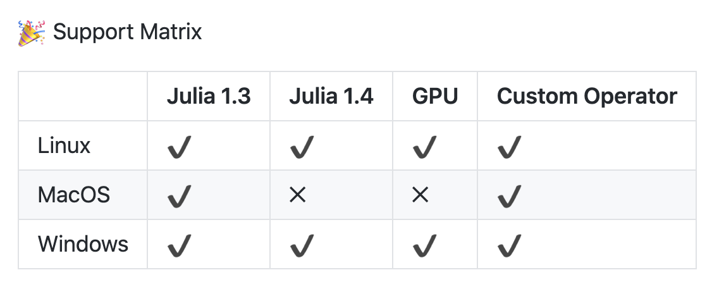
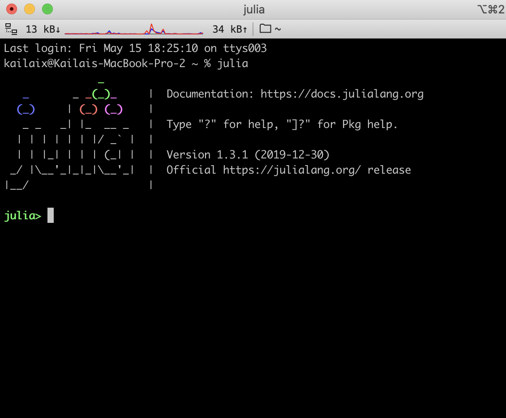
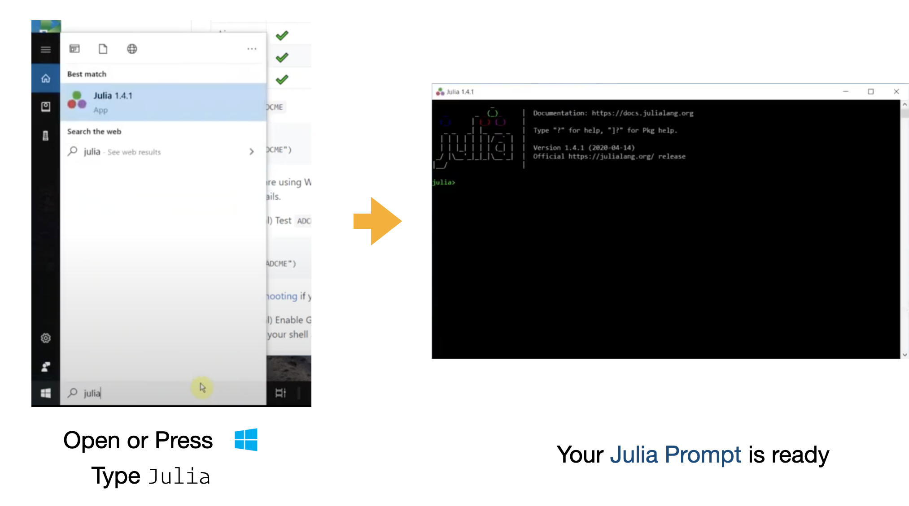
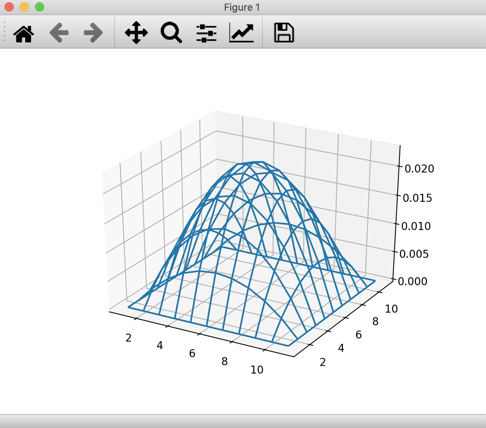

[Back to Homework](./HW6 Questions.md)

ADCME is tested and supported on Linux, macOS, and Windows systems. We have separate instructions for each operating system.

{:width="40%"}

You can also use the Stanford [Farmshare](https://srcc.stanford.edu/farmshare2) computing environment. ssh to `rice.stanford.edu` using your SUNetID. Use the Linux installation guide for this.

Please see the first three videos on [Canvas](https://stanford-pilot.hosted.panopto.com/Panopto/Pages/Sessions/List.aspx?folderID=c9d36ce3-e747-4a50-a866-acd801729122) for a step-by-step installation guide.

# ADCME installation instructions

If you have some earlier version of Julia already installed with a version at least 1.0, it should work, and you can skip the steps below. Go straight to step 2 "Install Project Dependencies." For Windows platforms, you will also need Microsoft Visual Studio 2017 15 (see below for instructions).

## 1. Install Julia

We will first install Julia binary and then configure the binary path so you can have easy access to Julia by typing `julia` in a terminal. But strictly speaking, configuring the path is unnecessary if you install the latest version (v0.7.0). 

### For Linux 

[Video with step-by-step instructions](https://stanford-pilot.hosted.panopto.com/Panopto/Pages/Viewer.aspx?id=f823ee8e-42b5-4004-a075-abb7005aa3b8)

See below for instructions on _rice_.

Download Julia 1.3, 1.4, or 1.5 from the [official website](https://julialang.org/downloads/). Uncompress the tarball to any directory you want. There is a directory `bin` inside the Julia directory you just uncompressed. Add the absolute path of the `bin` directory to your `PATH` environment variable. 

Suppose the Julia `bin` path is `<LocalJuliaPath>` (e.g., `~/julia-1.4.1/bin`), execute the following command in your terminal:

```bash
echo 'export PATH=<LocalJuliaPath>:$PATH' >> ~/.bashrc
```

In case you use another shell (e.g., `zsh`) other than bash, you need to replace `~/.bashrc` in the command with the corresponding startup file. You can use `echo $SHELL` to check which shell you are using. 

---

For _rice_, Julia is already installed. Just run

```bash
$ module load julia/1.3.1
```

This will load Julia 1.3.1.

The installation is very slow on _rice_. Please be prepared to wait for a long time. The installation is on the order of one hour because the file system on _rice_ is very slow. Once everything is installed, running the code is relatively fast.

### For macOS

[Video with step-by-step instructions](https://stanford-pilot.hosted.panopto.com/Panopto/Pages/Viewer.aspx?id=027f5390-6cad-4190-ab91-abb70055cb3c)

Due to an incompatibility issue with Julia 1.4 and TensorFlow 1.x, please download and install Julia 1.3 or 1.5 from the [official website](https://julialang.org/downloads/oldreleases/#v131_dec_30_2019). 

After installation, Julia-1.3 or Julia-1.5 will appear in your `Application` folder. Open the Julia application, and you will see the Julia prompt

```julia
julia> Sys.BINDIR
```

Example output:

```bash
"/Applications/Julia-1.3.app/Contents/Resources/julia/bin"
```

Add this path to your `PATH` environment variable (make sure to scroll to the right to copy the entire line below)

```bash
echo 'export PATH=/Applications/Julia-1.3.app/Contents/Resources/julia/bin:$PATH' >> ~/.bash_profile
```

On the most recent version of macOS, you need to replace `~/.bash_profile` by `~/.zshrc`. If you are unsure, type `ls ~/.zshrc`. If the file exists, this is the one you should use.

### For Windows

[Video with step-by-step instructions](https://stanford-pilot.hosted.panopto.com/Panopto/Pages/Viewer.aspx?id=e17b2799-0590-405a-9536-abc20017a4d8)

If you have a Windows OS, you will need to install Microsoft Visual Studio 2017 15. This software provides the necessary compilers for custom operators. See [Windows Installation](./windows_installation.md) for a detailed installation instruction. 

---

For Mac and Linux users, restart your shell to apply the new settings. Type `julia` in your terminal, and you should see a Julia prompt (Julia REPL).

{:width="40%"}

---

For Windows users, you can press the Windows button or click the Windows icon (usually located in the lower left of your screen) and type `julia`. Open the Desktop App `Julia` and you will see a Julia prompt. 

{:width="40%"}

## 2. Install the Project Dependencies

This homework requires installing some Julia packages. Start julia 

```bash
$ julia
```

and type

```julia
julia> ]
(@v1.4) pkg> add ADCME PyCall PyPlot
```

## 3. Start using ADCME

Now you can start using ADCME (ignore the warnings; they will disappear next time)

```julia
julia> using ADCME
julia> a = constant(ones(5,5))
julia> b = a * ones(5)
julia> sess = Session(); init(sess)
julia> run(sess, b)
```

Expected output:

```bash
5-element Array{Float64,1}:
 5.0
 5.0
 5.0
 5.0
 5.0
```

## 4. Test the Custom Operator Support

In the homework, we will use custom operators. To test whether your installation works for custom operators, try

```julia
julia> using ADCME
julia> ADCME.precompile()
```

If you encounter any compilation issue, please report it on Slack.

### Compile the Custom Operator for 2D Case

The final step explains how to compile the custom operator for the 2D Case. 

In `2DCase`, you have two source files: `HeatEquation.h` and `HeatEquation.cpp`. You need to compile them into a shared library, which you can use for the inverse modeling. To do so, go into `2DCase` directory and open a Julia prompt in a terminal. 

```julia
julia> using ADCME
julia> change_directory("cpp/build")
julia> ADCME.cmake()
julia> ADCME.make()
```
The command `change_directory("cpp/build")` makes a directory `cpp/build` if it does not exist and changes the current path to `cpp/build`. The command [ADCME.cmake()](https://cmake.org/cmake/help/latest/guide/tutorial/index.html) will run commands in the file `CMakeLists.txt` and create the appropriate Makefile. Then the command [ADCME.make()](https://www.gnu.org/software/make/manual/make.html) will compile the source code `HeatEquation.h` and `HeatEquation.cpp` to create the shared library.

After running this, you should see that there is a `libHeatEquation.so` (Linux), `libHeatEquation.dylib` (macOS), or `HeatEquation.dll` (Windows) in your `build` directory. 

Run the `Case2D/example.jl` file to check if the shared library works. You may see some warning messages. If you see the following output at the end:

```shell
run(sess, err) = 2.9971950130484027e-6
Congratulations! `example.jl` completed successfully
```

the code ran successfully.

If you run the code within the Julia REPL, you will see a figure. For this, start julia in the directory `Case2D`, which contains `example.jl`:

```shell
$ cd Case2D
$ julia
```

Then type:

```shell
julia> include("example.jl")
```
 
You will see the same output as above `run(sess, err) = 2.9971950130484027e-6` along with this figure:

{:width="40%"}

You can rotate the figure in 3D using your mouse.

On _rice_, you will not see the figure because you are connected remotely through `ssh` and you cannot see graphic windows, but you won't need this for the homework.

## Troubleshooting

Here are some common problems you may encounter on a Mac computer:


- You may encounter the following warning when you run `using PyPlot`.

---

PyPlot is using `tkagg` backend, which is known to cause crashes on macOS (#410); use the MPLBACKEND environment variable to request a different backend.

---

To fix this problem, add the following line immediately after `using PyPlot`

```julia
using PyPlot
matplotlib.use("agg")
```

The images may not show up but you can save the figure (`savefig("filename.png")`). 


- Your Julia program may crash when you run `BFGS!` and show the following error message.  

```
Error #15: Initializing libiomp5.dylib, but found libiomp5.dylib already initialized OMP: Hint: This means that multiple copies of the OpenMP runtime have been linked into the program. That is dangerous, since it can degrade performance or cause incorrect results. The best thing to do is to ensure that only a single OpenMP runtime is linked into the process, e.g. by avoiding static linking of the OpenMP runtime in any library. As an unsafe, unsupported, undocumented workaround you can set the environment variable KMP_DUPLICATE_LIB_OK=TRUE to allow the program to continue to execute, but that may cause crashes or silently produce incorrect results. For more information, please see http://www.intel.com/software/products/support/.
```

This is because `matplotlib` (called by `PyPlot`) and `scipy` (called by `BFGS!`) simultaneously access OpenMP libraries in an unsafe way. To fix this problem, add the following line in the **very beginning** of your script (or run the command right after you enter a Julia prompt)

```julia
ENV["KMP_DUPLICATE_LIB_OK"] = true 
```

- You may see the following error message when you run `ADCME.precompile()`:


```
The C compiler
 "/Users/<YourUsername>/.julia/adcme/bin/clang"
is not able to compile a simple test program.
It fails with the following output: ...
```

 
This is because your developer tools are not the one required by `ADCME`. To solve this problem, run the following commands in your terminal:

```
rm /Users/<YourUsername>/.julia/adcme/bin/clang
rm /Users/<YourUsername>/.julia/adcme/bin/clang++
ln -s /usr/bin/clang /Users/<YourUsername>/.julia/adcme/bin/clang
ln -s /usr/bin/clang++ /Users/<YourUsername>/.julia/adcme/bin/clang++
```

Here `<YourUsername>` is your user name. 
 
