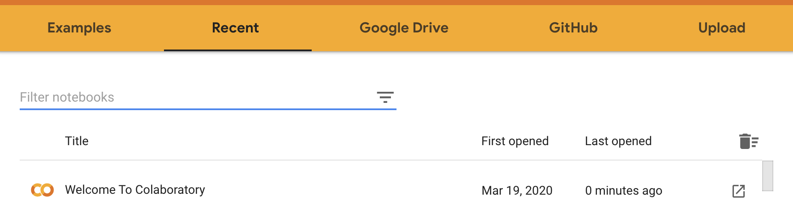

To run longer Python notebooks, you have the option of using Google colab. Your notebook will run in the cloud using Google Cloud computers.

To get setup, go to

[https://colab.research.google.com/](https://colab.research.google.com/)



There you will be able to upload your Python starter code and the data files required to run the homework assignment. Then open your notebook using Google Colab. 

There is a short online tutorial:

[https://colab.research.google.com/notebooks/intro.ipynb](https://colab.research.google.com/notebooks/intro.ipynb)

[Introduction to Colab](https://www.youtube.com/watch?v=inN8seMm7UI) video

Once your file are in the Google Colab directory (which is the same as `"My Drive/Colab Notebooks"` in Google Drive), you need to run a few commands to be able to access these files from within the notebook.

To do so, add the following near the top of your notebook:

```
from google.colab import drive
drive.mount('/content/drive')
%cd '/content/drive/My Drive/Colab Notebooks'  
%ls
```


You will need to authenticate with your Google account when running this cell. Make sure to use the same account you used to upload your homework files.

After that, you should be able to run your notebook as usual. The files in Google Colab will be be accessible from within the notebook.