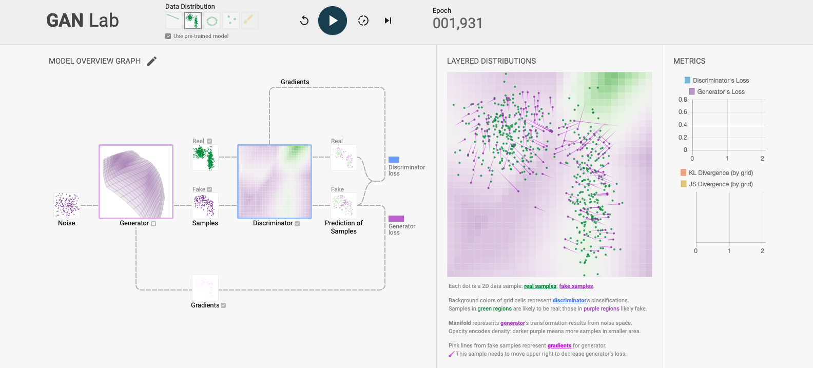
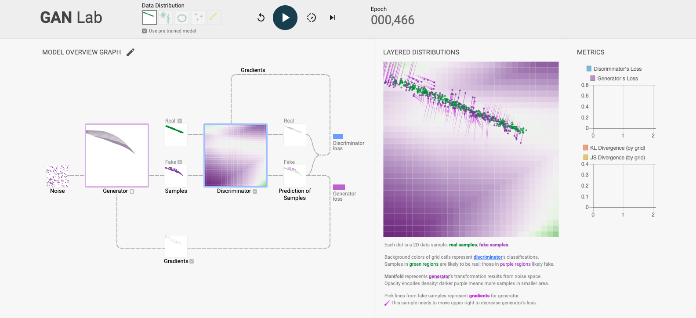
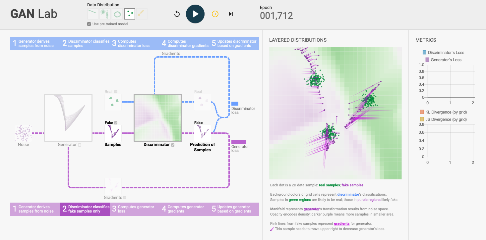
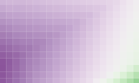
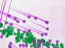
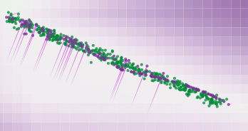
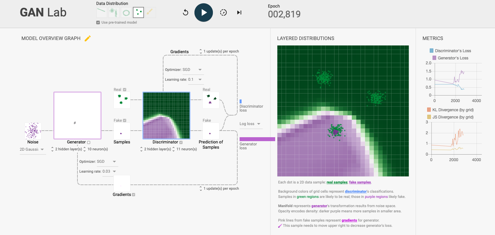
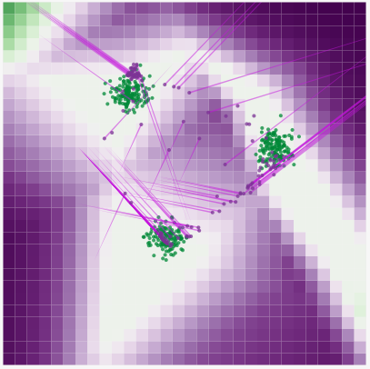
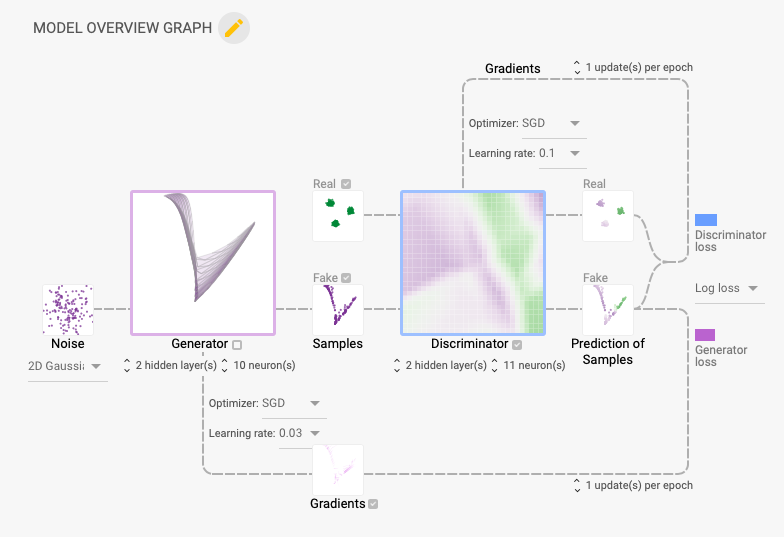

---
layout: page
title: Generative Adversarial Networks
--- 

Write your answers in a PDF and upload the document on [gradescope](https://www.gradescope.com/courses/102338) for submission. Each question is worth 10 points. Post on [Slack](https://stanford.enterprise.slack.com/) for questions.

Late day policy: 1 late day with a 20% grade penalty.

We won't have a full lecture on Generative Adversarial Networks (GANs). Instead we will give you some reading and an online demo lab to learn the basics concepts.

GAN are important in engineering because they allow modeling stochastic processes. For example in the [slide deck](https://ericdarve.github.io/cme216-spring-2020/Slides/AD/Inverse.pdf#page=10) on inverse modeling we had

$$ \frac{\partial u(x, t)}{\partial t} = \color{red}{\kappa(\varpi)}\Delta u(x, t) + f(x, t) $$

$\color{red}{\kappa(\varpi)}$ is a stochastic variable. In this case the concept of matching the data is more complicated. The training data will also be a random variable. So the inverse modeling process becomes one where we optimize $\kappa$ so that the statistics of $u_\text{pred}$ match the statistics of $u_\text{data}$. As you can imagine this is not an easy process.

The way to do that is to build a DNN $\kappa(z;\theta)$ such that if $z$ is a random variable then $\kappa(z;\theta)$ has the same statistical properties as $\color{red}{\kappa(\varpi)}$ (in some appropriate sense defined by the loss function).

This is a very powerful technique because it allows representing very general probability distributions. Without DNNs, we are typically much more limited. A common simplification, if DNNs and GANs are not used, is to assume that $\color{red}{\kappa(\varpi)}$ is a normal variable. Then the only parameters we can fit are the mean and standard deviation.

An important component of GAN is the use of the discriminative network. The discriminative network is trained to distinguish the real training samples $u_\text{data}$ from the "fake" samples generated by solving our PDE with $\kappa$ samples generated with our DNN $\kappa(z;\theta)$.

So two neural networks are at play. The generative DNN $\kappa(z;\theta)$ takes as input $z$ and generates random values for $\kappa$. The discriminative DNN $D$ takes as input $u$ and gives it a score: 0 if it believes it is "fake" (solution of PDE using $\kappa(z;\theta)$) and 1 if it is true (drawn from the training set). The generative DNN tries to generate samples that fool the discriminative DNN, while the discriminative DNN tries to tell the samples apart. Upon convergence we can prove that samples generated with $\kappa(z;\theta)$ are indistinguishable from the true distribution $\color{red}{\kappa(\varpi)}$. We call this approach that blends GANs with a numerical PDE solver [PhysGAN](https://arxiv.org/pdf/1910.06936.pdf).

The theory behind GANs is explained in [this seminal paper](https://arxiv.org/pdf/1406.2661.pdf) by Goodfellow, Pouget-Abadie, Mirza, Xu, Warde-Farley, Ozair, Courville, and Bengio. 

Start by reading this paper at least up to and including Section 3 "Adversarial nets". Section 4 on theoretical results is optional. Section 5 is optional. This was the first paper on GANs and the method has since greatly improved. To get a sense of what newer GANs can do, please visit this site [https://thispersondoesnotexist.com/](https://thispersondoesnotexist.com/).

In this paper $G$ is the generative DNN and $D$ is the discriminative DNN. Focus on Section 3 which contains a description of the method. In the paper $G(z;\theta_g)$ plays the role of $\kappa(z;\theta)$ above. The goal is to make $G(z;\theta_g)$ match the statistics of $x \sim p_\text{data}(x)$, that is samples drawn from the training set. The discriminative DNN $D$ tries to [maximize](https://arxiv.org/pdf/1406.2661.pdf#page=3)

$$ \mathbb E_{x \sim p_\text{data}(x)}[ \log D(x)] + \mathbb E_{z \sim p_g(z)}[ \log (1 - D(G(z))) ] \tag{1}$$

while $G$ tries to minimize this function; $\mathbb E$ is the expectation; $x$ is drawn from the training data (an approximation of $p_\text{data}(x)$) while $z$ is drawn from $p_g(z)$, which can be a Gaussian distribution or a uniform distribution.

The GAN method in the paper is a simpler setting than PhysGAN. $G$ generates samples and $D$ tries to discriminate these samples. In PhysGAN (similar to physics-informed learning) the output of $G$ is fed into a numerical PDE solver; the solution of this solver $u$ is then used as input to $D$. We can write the PhysGAN optimization problem as

$$ \min_G \max_D V(D,G) = \mathbb E_{u \sim p_\text{data}(u)}[ \log D(u)] +
\mathbb E_{z \sim p_g(z)}[ \log (1 - D(S_u(G_\kappa(z)))) ] $$

where $S_u$ is a numerical solver that can solve for $u$ using the PDE and some given $\kappa = G_\kappa(z)$.

After reading the [paper](https://arxiv.org/pdf/1406.2661.pdf), answer the following questions.

1. Show that in order to maximize the objective function [Eq. (1)](https://arxiv.org/pdf/1406.2661.pdf#page=3) in the paper, $D$ tries to output 1 when $x \sim p_\text{data}(x)$ and 0 when $x = G(z)$ with $z \sim p_g(z)$. Recall that $0 < D \le 1$. Explain why this is consistent with the statement that $D$ tries to determine whether $x$ is real or not.
1. Show that in order to minimize the objective function, $G$ tries to produce a $G(z)$ such that $D(G(z)) \sim 1$. Explain why this shows that $G$ tries to fool $D$.
1. In [Figure 1](https://arxiv.org/pdf/1406.2661.pdf#page=3), panel (b), explain why the blue curve is close to 1 on the left and close to 0 on the right.
1. In [Figure 1](https://arxiv.org/pdf/1406.2661.pdf#page=3), panel (c), explain what is happening to the green curve and why it is moving to the left.

In the theoretical section 4, it is shown that the optimal discriminator $D$ satisfies [Eq. (2)](https://arxiv.org/pdf/1406.2661.pdf#page=4) in the paper:

$$ D^*(x) = \frac{p_\text{data}(x)}{p_\text{data}(x) + p_g(x)} \tag{2} $$

{:start="5"}
1. Using Eq. (2), explain why in [Figure 1](https://arxiv.org/pdf/1406.2661.pdf#page=3), panel (d), the blue line is equal to $1/2$.

We are now going to experiment with an online tool to further explore these concepts. Please visit the [GAN Lab](https://poloclub.github.io/ganlab/) page.

This is the page you should see:

Click on "Data Distribution" on the top, select the left-most model (the green line); select the button "Use pre-trained model":

Experiment with this tool and read the documentation on the web page, below the lab tool.

You can click on the small button {:width="20px"} next to the "Play" arrow to see step-by-step explanations:

After experimenting, you should be able to answer the following questions.

{:start="6"}
1. What do the colors purple, green, and white represent in the figure below?

{:start="7"}
1. What do the little arrows represent in the figure below? How are these arrows used to move the purple dots?

{:start="8"}
1. Train the model by clicking the "Play" button at the top until you are satisfied with the convergence of the model. Take a screenshot and paste into your PDF.

{:width="20%"}

Click on the 4th model at the top and again use the pre-trained model. If you train the model for a while, you may get this:

Note that since the training has a random component, you cannot reproduce this consistently. But you will get something similar after a while. The purple dots may be on top of a different green "circle."

Observe how all the purple nodes are on top of only one green circle instead of being distributed over the three. This is a well-known problem of GAN called "mode-collapse." The problem is that $z$ is a normal random variable. You can think of $z$ as living in the unit sphere. Since $G$ is continuous, the output $G(z)$ should be a [connected set](https://en.wikipedia.org/wiki/Connected_space); that is the set should be made of only "one piece," however complicated it may be. Since the green dots are formed by essentially 3 disconnected sets, there is a problem. The output $G(z)$ cannot simultaneously and perfectly lie over the three green circles. To solve this $G(z)$ has basically two strategies. Either it places purple dots over the three green regions but then there must be purple dots in between (see figure below); or $G(z)$ selects one of the green regions and places all the purple dots there.

{:start="9"}
1. Run the lab tool until you see a mode collapse; take a screenshot and paste it into the PDF. Make sure to generate your own screenshot. Do not copy someone else's. It may take some time to get mode collapse but the optimizer should get there eventually. Once you reach mode-collapse the solution typically stays there for a long time. If it seems to take too long, you can try to restart the simulation by clicking the {:width="20px"} button.

If you are curious you can click on "Model overview graph" to get more options and information on the different components of the GAN model and training strategy:

