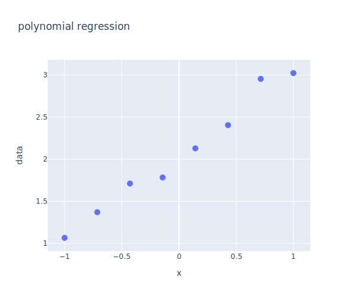

---
layout: page
title: Learning rate and overfitting
--- 

Write your answers in a PDF and upload the document on [gradescope](https://www.gradescope.com/courses/102338) for submission. Each question is worth 10 points. The due date is given on [gradescope](https://www.gradescope.com/courses/102338). Post on [Slack](https://stanford.enterprise.slack.com/) for questions.

Late day policy: 1 late day with a 20% grade penalty.

The next questions refer to slide deck "3.6 Learning rate for training."

1. How many steps does it take to minimize a loss function that is quadratic if you can compute the gradient and the inverse of the Hessian matrix?
1. Take a loss function that is quadratic, with $$H$$ symmetric positive definite. Prove that, with an appropriate change of variable, the update rule can be written as a decoupled set of equations: $$\Delta Z = - \alpha \Lambda Z$$, where $$\Lambda$$ is a diagonal matrix.
1. Describe the convergence of a gradient-based method when the ratio $$\lambda_1 / \lambda_n$$ is close to 1 and when this ratio is large.

The next question refers to slide deck "3.7 Empirical method for learning rate."

{:start="4"}
1. Write a few lines of Python code to implement a learning rate schedule in which the learning rate decays like 1/epoch. Use a formula like 

`initial_learning_rate / (1 + decay_rate * epoch / decay_step)`

You need to implement a Python function that returns the learning rate (following the example in the slides), then one line to call `keras.callbacks.LearningRateScheduler(...)` and the call to `dnn.fit(...)` using `callbacks=[...]`. 

TensorFlow documentation: [LearningRateScheduler](https://www.tensorflow.org/api_docs/python/tf/keras/callbacks/LearningRateScheduler).

The next question refers to slide deck "3.8 Overfitting."

Consider the figure below

The figure contains 8 points. We can fit a polynomial of order 7 through all these data points. 

{:start="5"}
1. How accurate is this polynomial fitting procedure if we want to make predictions? What polynomial would you fit through this data in order to make accurate predictions? Explain how this is related to the concept of overfitting.

Extra reading relevant to this problem: [Overfitting](https://en.wikipedia.org/wiki/Overfitting)
