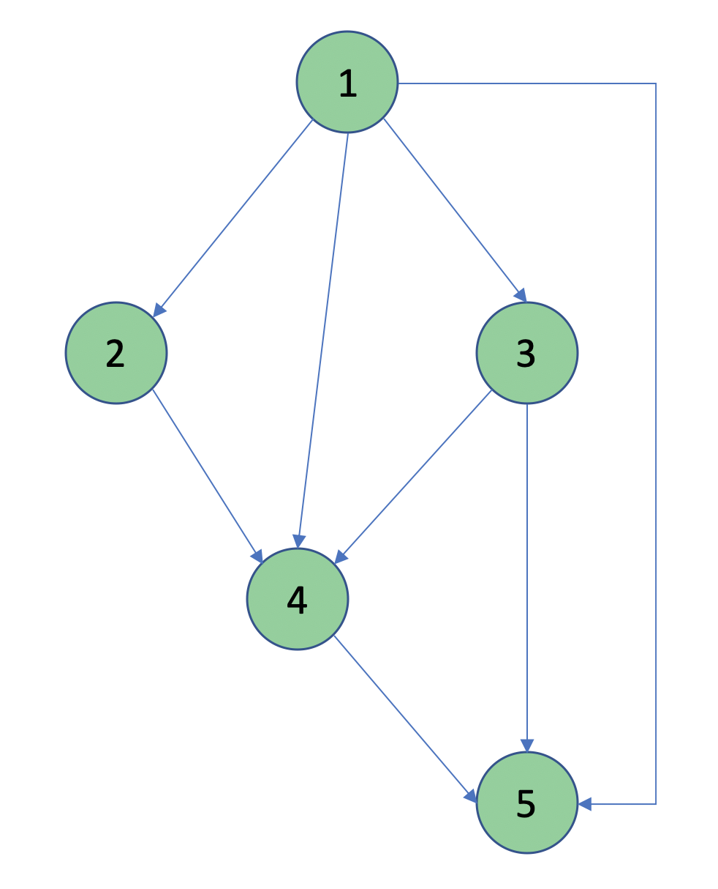
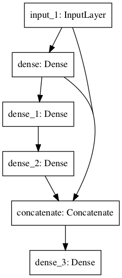

## Perceptron, MLP, TensorFlow

Write your answers in a PDF and upload the document on [Gradescope](https://www.gradescope.com/courses/222525) for submission. The due date is given on [Gradescope](https://www.gradescope.com/courses/222525).

Each question is worth 10 points. 

Please watch the videos and slides before answering these questions.

1. 2.1 Perceptron. To train a perceptron or multi-layer perceptron we need to differentiate the loss function with respect to the model parameters. Explain why this makes the Heaviside function unsuitable for training.
1. 2.1 Perceptron. Find and prove the relation between sigmoid and tanh.
1. 2.1 Perceptron. What happens when you choose a learning rate that is too small? Describe what happens when the learning rate is too large.
1. 2.2 MLP. Consider a perceptron where $\phi$ is a linear function, e.g., $\phi(x) = x$; show that for the XOR problem, there is no linear perceptron that can reproduce this data.
1. 2.2 MLP. Consider the figure below. This is a directed acyclic graph or DAG. Assume that node 1 is set equal to the input $x$. We build an ANN based on this graph. The output $y$ is at node 5. Explain qualitatively the sequence of operations the ANN performs to transform the input $x$ to the output $y$ following this DAG. Assume that the activation function is some given function $\phi(x)$.

{:width="25%"}

{:start="6"}
1. 2.2 MLP. Consider a generic multi-layer stacked perceptron. Describe using equations the sequence of operations that are performed, going from the input layer to the output layer.
1. 2.3 TensorFlow/Keras. Explain the difference between Keras and `tf.keras`. This [blog](https://www.pyimagesearch.com/2019/10/21/keras-vs-tf-keras-whats-the-difference-in-tensorflow-2-0/) has a good summary of some of the main features of TensorFlow 2.0 and its relation to Keras.
1. 2.4 Sequential API and 2.5 Functional API. Explain when you would use the Sequential API vs the Functional API in TensorFlow.
1. 2.5 Functional API. Write a few lines of Python to implement the DNN shown below using the Functional API. The input has dimension 8. The output has dimension 2. All layers are fully connected. The activation function is `tanh`.

Output of `keras.utils.plot_model(model)`

    Model: "model"
    __________________________________________________________________________________________________
    Layer (type)                    Output Shape         Param #     Connected to                     
    ==================================================================================================
    input_1 (InputLayer)            [(None, 8)]          0                                            
    __________________________________________________________________________________________________
    dense (Dense)                   (None, 32)           288         input_1[0][0]                    
    __________________________________________________________________________________________________
    dense_1 (Dense)                 (None, 16)           528         dense[0][0]                      
    __________________________________________________________________________________________________
    dense_2 (Dense)                 (None, 8)            136         dense_1[0][0]                    
    __________________________________________________________________________________________________
    concatenate (Concatenate)       (None, 48)           0           input_1[0][0]                    
                                                                     dense[0][0]                      
                                                                     dense_2[0][0]                    
    __________________________________________________________________________________________________
    dense_3 (Dense)                 (None, 2)            98          concatenate[0][0]                
    ==================================================================================================
    Total params: 1,050
    Trainable params: 1,050


{:width="20%"}

{:start="10"}
1. 2.6 Subclassing. Explain what the declarative and imperative styles of programming are. Try to give examples of both.
1. 2.6 Subclassing. Explain what Python inheritance is.
1. 2.6 Subclassing. Explain what the `__init__()` function does in Python.
1. 2.6 Subclassing. Explain what `super()` does in Python.
1. 2.6 Subclassing. In a notebook, run the following code:
```Python
import tensorflow as tf
inputs = tf.keras.Input(shape=(32,))
x = tf.keras.layers.Dense(64, activation='relu')(inputs)
outputs = tf.keras.layers.Dense(10)(x)
mlp = tf.keras.Model(inputs, outputs)
```
Describe the structure of this DNN.
1. 2.6 Subclassing. Implement the same DNN using the subclassing interface. Follow the instructions below. Check that the output is correct by comparing with the solution given below.

**Instructions**

Call your class `MLP`
```Python
class MLP(tf.keras.Model):
    [...]
```

You can set the name of your model to `mlp_subclassing` by calling:
```Python
super(MLP, self).__init__(name="mlp_subclassing", **kwargs)
```
in the constructor `__init__(self, **kwargs)`.

Run this code in your notebook _after creating the class:_
```Python
# Instantiate the model.
mlp_subc = MLP()
# The model doesn't have a state until it's called at least once.
_ = mlp_subc(tf.zeros((1, 32)))
mlp_subc.summary() # Print summary of model
```

Verify that the output is

    Model: "mlp_subclassing"
    _________________________________________________________________
    Layer (type)                 Output Shape              Param #   
    =================================================================
    dense (Dense)                multiple                  2112      
    _________________________________________________________________
    dense_1 (Dense)              multiple                  650       
    =================================================================
    Total params: 2,762
    Trainable params: 2,762
    Non-trainable params: 0


{:start="16"}
1. 2.5 Functional API and 2.6 Subclassing. Which interface between functional and subclassing appears to be the simplest? When would you recommend to use the functional API vs the subclassing API?