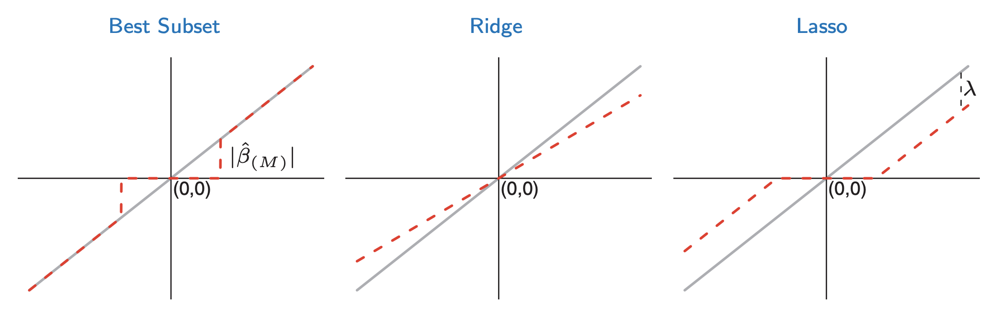
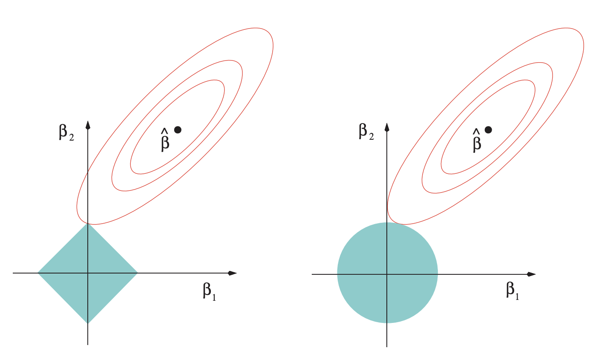

---
layout: page
title: Initializers and regularizers
--- 

Write your answers in a PDF and upload the document on [gradescope](https://www.gradescope.com/courses/102338) for submission. Each question is worth 10 points. The due date is given on [gradescope](https://www.gradescope.com/courses/102338). Post on [Slack](https://stanford.enterprise.slack.com/) for questions.

Late day policy: 1 late day with a 20% grade penalty.

The next questions refer to slide deck "3.9 DNN initializers."

1. Explain the problem of vanishing gradient in deep learning.
1. Using a simple argument, explain why the variance of the weights $$w_{ij}$$ should depend on the size of the layers.
1. Assume that layer $$i$$ has 4 nodes and layer $$i+1$$ has 5 nodes. How would you initialize the weight matrix that connects layers 4 and 5 using the Glorot-Bengio formula given in the slides?

Additional reading: [Understanding the difficulty of training deep feedforward neural networks](http://proceedings.mlr.press/v9/glorot10a/glorot10a.pdf) by Glorot and Bengio. See their famous equation (16) on p. 253.

The next questions refer to slide deck "3.10 Regularization."

{:start="4"}
1. Write a few lines of Python, with TensorFlow, to define a dense fully connected layer with 16 output nodes, an initializer for the weights that sets all the weights equal to the constant 1/4, and an l1 regularizer on the weights with parameter $$\lambda = 0.001$$. 

[Regularizer documentation](https://www.tensorflow.org/api_docs/python/tf/keras/regularizers/Regularizer) in TensorFlow. See also the section "Configure the layers" in [Keras overview](https://www.tensorflow.org/guide/keras/overview) for examples.

{:start="5"}
1. Explain the difference between l1 and l2 regularization. If you want a sparser network, which regularization would you pick? Which type of regularization is typically easier to solve for numerically?

For additional reading, please check [The Elements of Statistical Learning](https://searchworks.stanford.edu/view/7868647) by Stanford professors Trevor Hastie, Robert Tibshirani, and Jerome Friedman. The book is accessible online. You can check section 3.4.3 which compares l1 and l2 regularizations. The loss function in this case is quadratic. The unknowns are $$\beta$$. l2 is described in section 3.4.1. It's the ridge regression method. See Eqns. (3.41) and (3.42) p. 63. Lasso corresponds to the l1 regularization. See Eqns. (3.51) and (3.52) in Section 3.4.2, p. 68. Section 3.4.3 compares these methods. Table 3.4, p. 71, shows the optimal $$\beta$$ selected by each method. "Best subset" tries to pick the best $$M$$ coefficients for the fit and zeros out all the others. This is a possible regularization method. You can see how Lasso tends to zero out coefficients. 

The $$x$$-axis is $$\beta$$ without regularization and the $$y$$-axis is $$\beta$$ with regularization. Ridge is l2 and Lasso is l1. Small values of $$\beta$$ are zeroed out by Lasso. The grey line is the solution without regularization.

Fig. 3.11, p. 71, shows the quadratic loss function (red ellipses in the top right). The regularizing constraints are shown as a blue square (left, l1) and a circle (right, l2). This figure illustrates why l1 regularization tends to lead to solutions that are sparse.

